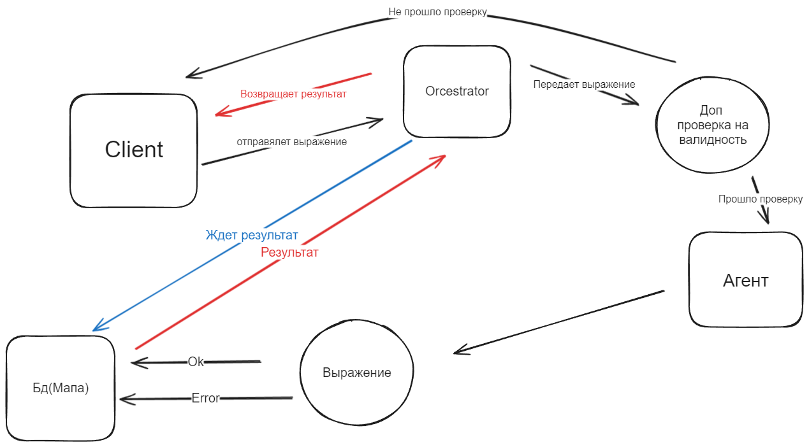

Этот проект представляет собой пример веб-приложения на языке программирования Go (Golang).
 Он включает в себя сервер HTTP для обработки запросов и взаимодействия с пользователем через веб-интерфейс.

Зависимости
Для корректной работы приложения используются следующие зависимости:

encoding/json - для работы с форматом JSON.
fmt - для форматирования и вывода данных.
github.com/Knetic/govaluate - библиотека для оценки и интерпретации математических выражений. Для установки используйте "go get github.com/Knetic/govaluate"
html/template - для создания и обработки HTML-шаблонов.
log - для вывода журнала сообщений.
net/http - для создания веб-серверов и обработки HTTP-запросов.
strconv - для преобразования строк в числа и обратно.
strings - для работы со строками.
sync - для работы с механизмами синхронизации.
time - для работы со временем и датами.

Описание типов

CalculationResult
Хранит в себе результат и изначальное выражение.
type CalculationResult struct {
    Expression string
    Result     int
}

MapCalculator
Мапа для результатов и выражений.
type MapCalculator struct {
    result map[string]Calculator
}

Calculator
Хранит в себе все данные о выражении и его выполнении.
type Calculator struct {
    Results       CalculationResult
    countPlus     int
    countMinus    int
    countMultiply int
    countDivide   int
    tComlete      bool
    Timers        Timer
    mu            sync.Mutex
}

Timer
Хранит в себе стандартное время выполнения операций.
type Timer struct {
    TimerPlus           int
    TimerMinus          int
    TimerMultiply       int
    TimerDivide         int
    TimerInactiveServer int
}

Data
Структура для хранения данных о выражении.
type Data struct {
    Id     int
    Input  string
    Result int
    t      bool
}
Функции
Process(expression string, timers Timer) Calculator: Функция выполняет все вычисления и заполняет структуры.

countPlus(input string) int: Функция подсчитывает количество символов "+" в строке.

countMinus(input string) int: Функция подсчитывает количество символов "-" в строке.

countMultiply(input string) int: Функция подсчитывает количество символов "*" в строке.

countDivide(input string) int: Функция подсчитывает количество символов "/" в строке.

solveMathExpression(expression string) (float64, error): Функция вычисляет математическое выражение.

HTTP Обработчики
/update: Обновление данных.
/update_table_body2_data: Обновление данных в таблице.
/: Обработка главной страницы и обновление результатов вычислений.
/switch: Обработка переключения на страницу настроек.
/switch2: Обработка переключения на страницу с активностью сервера.
Запуск
Для запуска приложения выполните следующую команду:

go run main.go

После этого приложение будет доступно по адресу http://localhost:8080/

Tg: @Satl_15
